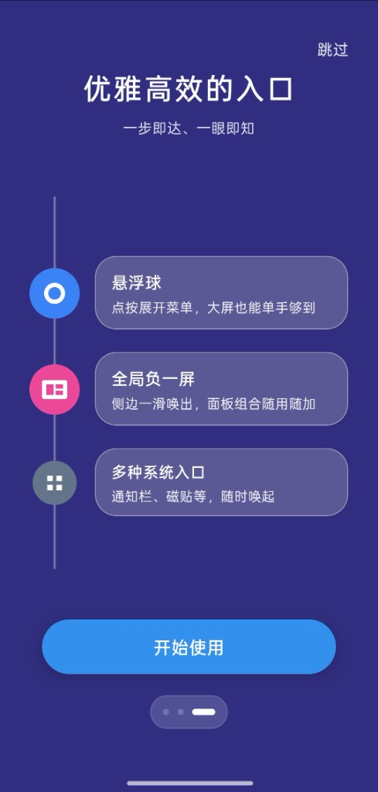
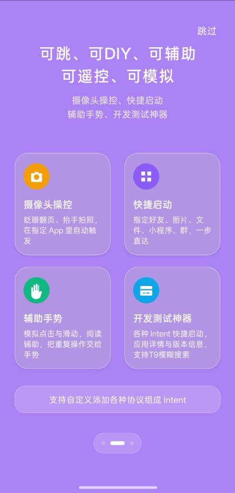
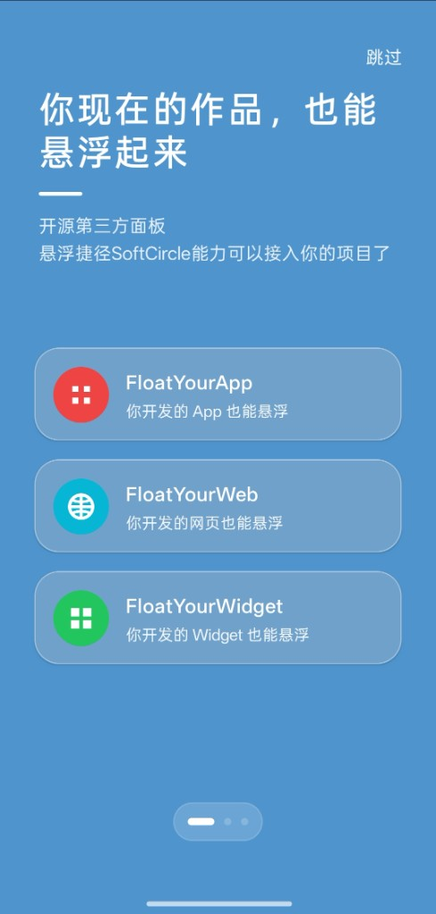

# FloatYourApp（开源）

把你开发的 App **接入 SoftCircle 负一屏**，以远程面板形式悬浮展示。本仓提供 Demo、文档与 Cursor Skill（不是系统桌面 AppWidget，也不是 SDK 源码）。

本仓示例代码与文档采用 **Apache-2.0**。依赖的 Client AAR（`com.softcircle.cardwidget:cardwidget-client`）为 SoftCircle **专有** 二进制，源码不在本仓。

---

## SoftCircle 是什么

**悬浮捷径 SoftCircle** 是以「悬浮球 + 侧边栏」为全局入口的多合一效率工具箱。

集快捷启动、悬浮浏览器、全局负一屏、BigBang 大爆炸、代理显示其他应用 Widget、剪切板速记、悬浮网页于一体，主打**大屏手机单手高效操作**。

下载宿主：[softcircle.cn](https://www.softcircle.cn)

### 优雅高效的入口

一步即达、一眼即知。

| 能力 | 说明 |
|------|------|
| **悬浮球** | 点按展开菜单，大屏也能单手够到 |
| **全局负一屏** | 侧边一滑唤出，面板组合随用随加 |
| **多种系统入口** | 通知栏、磁贴等，随时唤起 |

<p align="center">
  
</p>

### 可跳、可 DIY、可辅助 · 可遥控、可模拟

摄像头操控、快捷启动；辅助手势、开发测试神器。支持自定义添加各种协议组成 Intent。

| 能力 | 说明 |
|------|------|
| **摄像头操控** | 眨眼翻页、抬手拍照，在指定 App 里自动触发 |
| **快捷启动** | 指定好友、图片、文件、小程序、群，一步直达 |
| **辅助手势** | 模拟点击与滑动，阅读辅助，把重复操作交给手势 |
| **开发测试神器** | 各种 Intent 快捷启动，应用详情与版本信息，支持 T9 模糊搜索 |

<p align="center">
  
</p>

### 你现在的作品，也能悬浮起来

开源第三方面板：悬浮捷径 SoftCircle 能力可以接入你的项目。

| 方向 | 说明 |
|------|------|
| **FloatYourApp** | 你开发的 App 也能悬浮（本仓） |
| **FloatYourWeb** | 你开发的网页也能悬浮 |
| **FloatYourWidget** | 你开发的 Widget 也能悬浮 |

<p align="center">
  
</p>

本仓库对应 **FloatYourApp**：用 Client AAR 把你的面板挂进 SoftCircle 全局负一屏。

---

## 前提：先装 SoftCircle 宿主

负一屏的发现、添加、真机展示都依赖 **SoftCircle**。请先安装宿主，再装本 Demo / 你的接入 App。

- 下载：[softcircle.cn](https://www.softcircle.cn)
- Demo **主界面预览**可不装宿主；**负一屏真实效果**必须装 SoftCircle

## 依赖

仓库已内嵌 `maven-repo/`（免 token）。也可在克隆后直接构建：

```gradle
repositories {
    maven { url = uri("${rootProject.projectDir}/maven-repo") }
    // 公开 clone 后亦可用：
    // maven { url = uri("https://raw.githubusercontent.com/SoftCircle314/FloatYourApp/main/maven-repo") }
    google()
    mavenCentral()
}

dependencies {
    implementation "com.softcircle.cardwidget:cardwidget-client:0.1.0"
}
```

## 三步接入（多面板）

```kotlin
CardWidgetClient.installPanels(this) {
    panel("stopwatch", label = "秒表演示") { host ->
        StopwatchPanelView(host.context).also {
            it.bind("远程面板", host.cardWidgetId)
            host.setClickUri(it.browserButton, "https://www.baidu.com")
        }
    }
    panel("promo", label = "运营演示") { host ->
        PromoPanelView(host.context).also {
            host.setClickOpenApp(it.openAppButton, MainActivity::class.java)
        }
    }
}
```

Manifest 不用改。SoftCircle 扫描列表会出现 **两个** 面板。

## Demo 说明

| 面板 | 作用 |
|------|------|
| 秒表演示 | 持续刷新 + reattach 状态 + 浏览器跳转 |
| 运营演示 | 典型换量：文案 + 打开本 App |

## 验证

1. 安装 SoftCircle（见上文）
2. 安装 Demo：

```bash
./gradlew :demo:installDebug
```

3. SoftCircle → 负一屏 → 添加远程面板 → 「秒表演示」/「运营演示」

## Cursor Skill（可选）

用 Cursor 往**自己的 App** 里接入时，可启用本仓 skill：

[`.cursor/skills/softcircle-remote-panel/SKILL.md`](.cursor/skills/softcircle-remote-panel/SKILL.md)

在对话里说明目标工程与面板需求即可；skill 会按依赖 → XML → `installPanels` → 验证清单改工程。

## 更多

- [快速接入](docs/cardwidget/quickstart.md)
- [公开 API](docs/cardwidget/public-api.md)
- [换量合作](docs/cardwidget/partnership.md)
